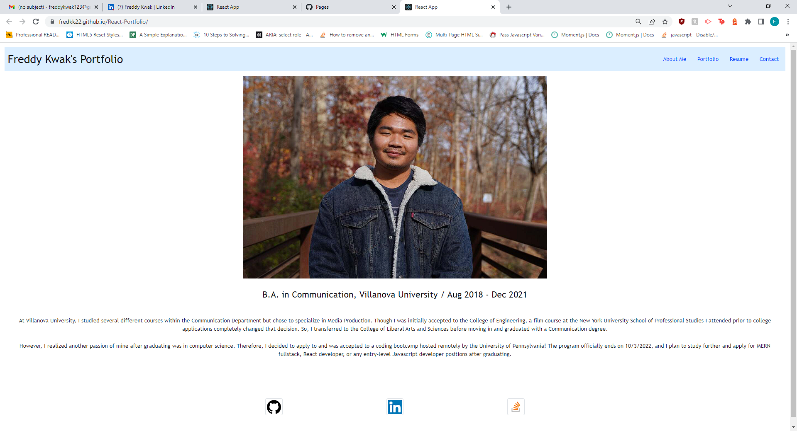

# React-Portfolio

## Table of Contents
- [React-Portfolio](#react-portfolio)
  - [Table of Contents](#table-of-contents)
  - [Description](#description)
  - [Screenshot of Deployed Application](#screenshot-of-deployed-application)
  - [Credits](#credits)
    - [Special Thanks](#special-thanks)
    - [Links Used for Reference](#links-used-for-reference)
  - [Link to Deployed Application](#link-to-deployed-application)

## Description

The Module 19 challenge was to create a single-page text editor application that meets the criteria of a PWA, allowing the user to install the application for offline use as well as saving text for access after editing while both online and offline.

The reason for creating a portfolio was to develop our skills and knowledge in PWA (Progressive Web Applications) and service workers further and to create our first web application that can be downloaded and accessed when offline.

I was able to learn more about and become more comfortable with PWAs, though I had some difficulty with service workers and needed guidance from my instructor.

## Screenshot of Deployed Application

## Credits

### Special Thanks

Sean Dillon: https://github.com/DeviousDoge/

Lucas Rozon: https://github.com/Zym0tic

### Links Used for Reference

https://www.pluralsight.com/guides/handling-multiple-inputs-with-single-onchange-handler-react

https://www.digitalocean.com/community/tutorials/how-to-create-a-static-footer-with-html-and-css-section-7

https://www.w3schools.com/howto/tryit.asp?filename=tryhow_css_fixed_footer

## Link to Deployed Application

https://fredkk22.github.io/React-Portfolio/